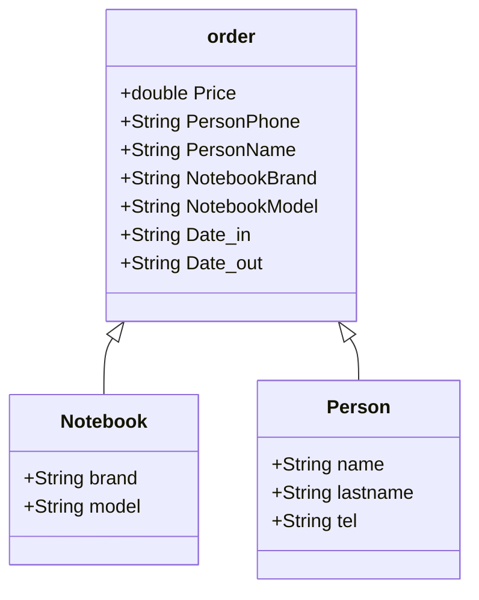

# Final Project

ความเป็นมาของโปรแกรม
```
สนใจในการทําออเดอร์ จึงนําการรับข้อมูลออเดอร์จากการซ่อมคอมมาลองทําโปรแกรม
บันทึกข้อมูลต่างๆของลูกค้า เช่น แบรนด์โน๊ตบุ๊ค ชื่อ นามสกุล เบอร์ติดต่อ เป็นต้น
```
วัตถุประสงค์ของโปรแกรม
```
เพื่อให้เก็บข้อมูลได้ง่ายขึ้น และตอบสนองความต้องการของคนที่ต้องการใช้ 
เพื่อนําความรู้จากที่เรียนมาไปใช้ในชีวิตจริง
```
โครงสร้างของโปรแกรม Classdiagram


    
```ผู้พัฒนาโปรแกรม : นางสาวอรปรียา จันทะโคตร 653450107-5 ```
